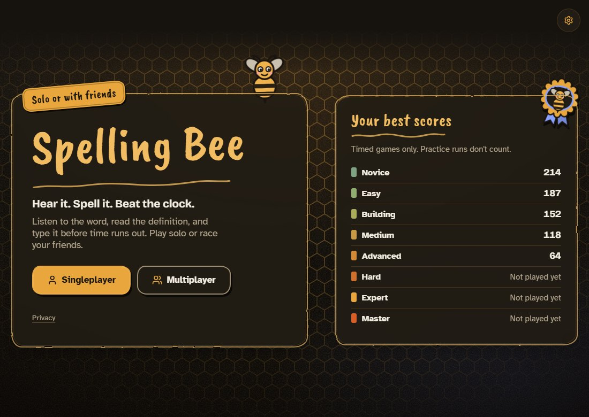
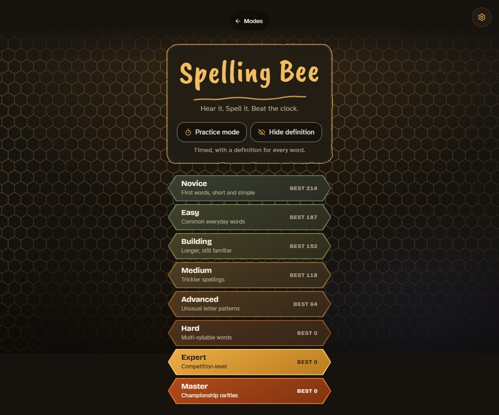
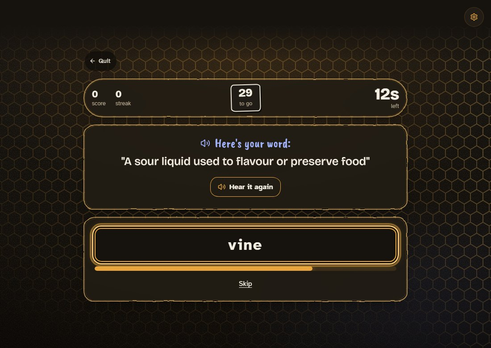
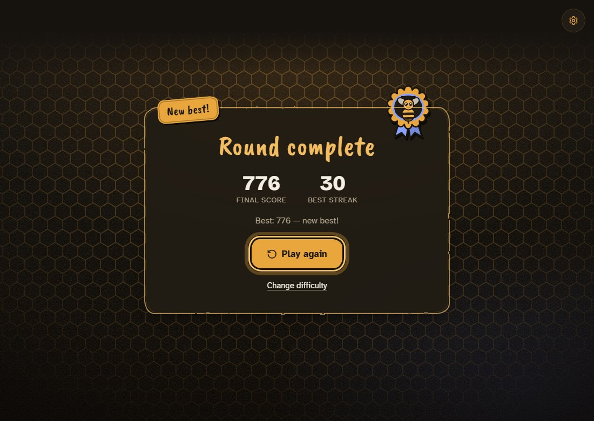
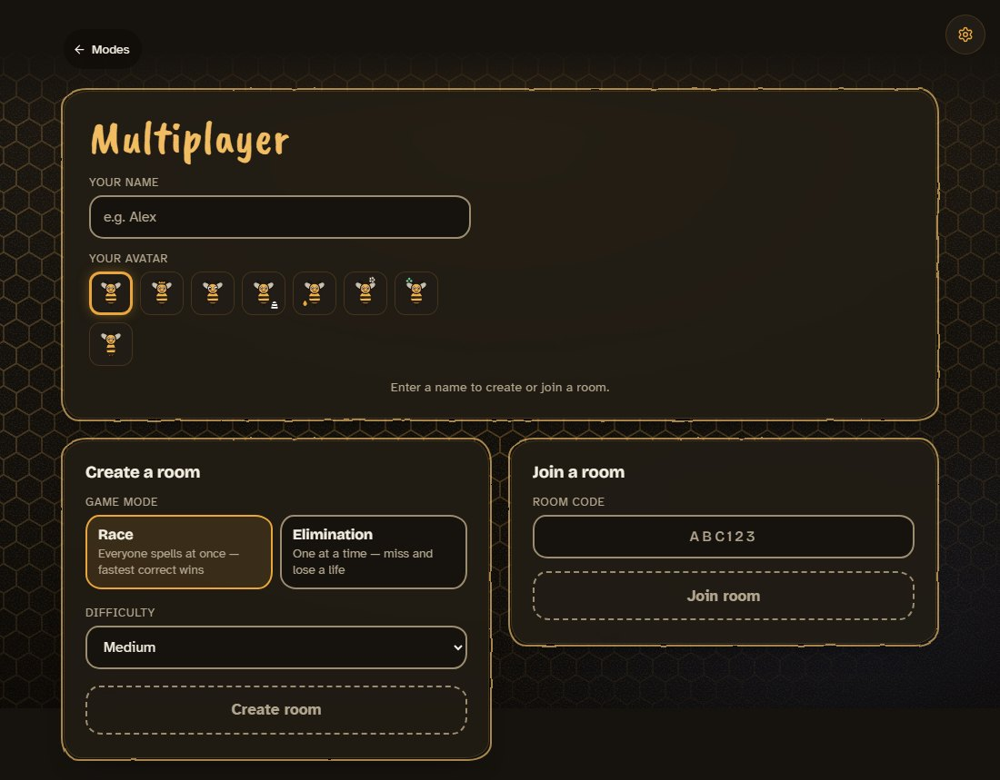
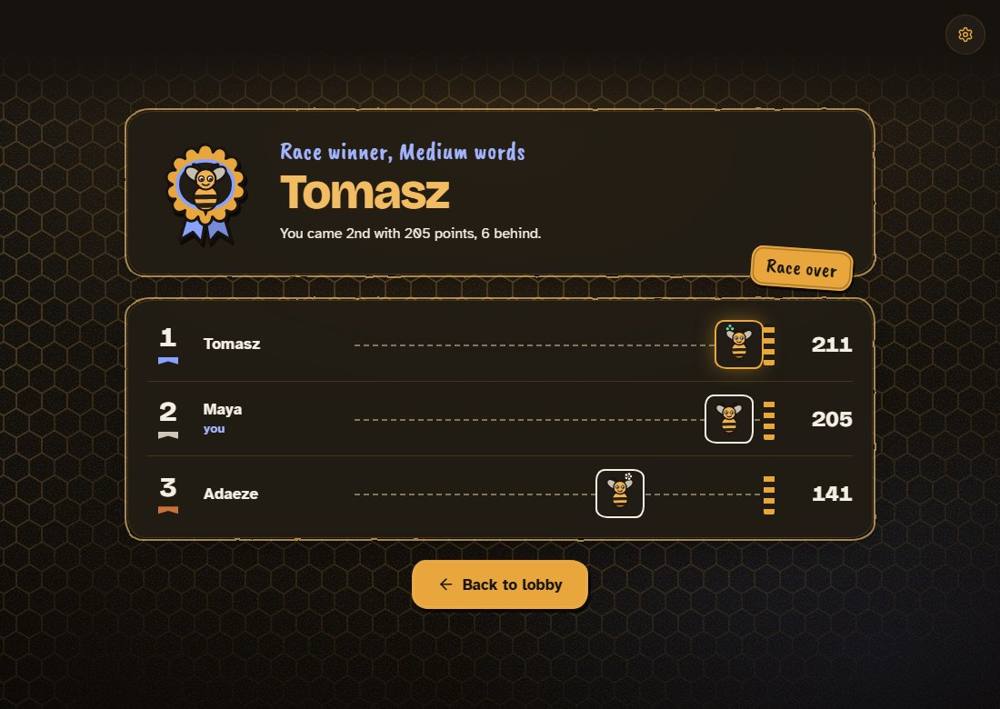

# Spelling Bee

A timed spelling game for the browser: it reads a word aloud, you type it. Play alone or against friends in real-time multiplayer rooms.

**Play it:** https://iangopen.github.io/spellingbee/

<p>
  
  
  
</p>
<p>
  
  
  
</p>

The multiplayer and elimination screens above are rendered with mocked state, so no player was created to take them; the singleplayer ones were played for real on a local build. [`design/harness/shoot-readme.mjs`](design/harness/shoot-readme.mjs) retakes them.

## What it is

The browser's voice speaks each word, and a short definition is shown under it. You type the spelling before the clock runs out.

- **1,200 words** in **8 difficulty tiers** of 150 each, from Novice to Master. Every definition was written for this project.
- **Look and feel:** a honey-and-cream palette with a dark default (the system setting is not followed; Settings has a Light and a Dark switch), a slow-moving honeycomb behind everything that stops under reduced motion, a hand-drawn bee, bee avatars and a rosette for a new best. Every colour is a theme token, text always sits on a panel, and contrast, focus rings and keyboard order are measured, not assumed (see below).
- **Singleplayer:** 30 words per run, 13 to 22 seconds per word depending on the tier. A correct word scores 10 plus the seconds left. Practice mode turns the clock off, and hide-definition mode leaves you only the audio.
- **Multiplayer:** rooms of up to 8 players, in two modes.
  - **Race:** everyone gets the same word, and the fastest correct answer wins the round. 10 rounds.
  - **Elimination:** players take turns, and a miss costs a life (1 to 9, default 3). Turns get shorter as players drop out and as the table builds a streak.
- **The server keeps score.** Answers are checked and scored in Postgres functions that clients cannot call directly. The browser only receives the results. Five edge functions handle authentication and HTTP, and 20 migrations define the schema, row-level security, rate limits and data retention.

Built with React 19, TypeScript and Vite. Multiplayer runs on Supabase: Postgres, anonymous auth, Realtime, Deno edge functions and pg_cron.

## Get started

You need Node.js 22.12 or later (Vitest 5 requires it).

```sh
npm ci
npm run dev        # http://localhost:5173/spellingbee/
```

Singleplayer works with no further setup. Multiplayer needs a Supabase project and a `.env.local`; see [`supabase/README.md`](supabase/README.md).

```sh
npm test           # 117 client and build-input tests (Vitest): logic, screens, standings, sounds, brand assets, licences
npm run test:db    # 94 database tests: the real migrations under PGlite
npm run build      # type-check and production build
npm run lint       # oxlint
```

### Checks that need a browser

Playwright is deliberately not a dependency (it is a large download and only these scripts use it). Install it anywhere outside the repo and point `PW_MODULE` at it; [`design/README.md`](design/README.md) has the commands. The scripts in `design/harness/` drive the real screens (with mocked state) or the production build:

| Script | What it proves |
|---|---|
| `measure.mjs` (`TARGET=app`) | contrast of every text, edge and focus ring against the worst pixel behind it, both themes, both widths |
| `check-tier-bars.mjs`, `check-settings-dialog.mjs` | the hexagon bars' tap targets and focus rim; the Settings dialog's focus handling |
| `check-reduced-motion.mjs` | reduced motion leaves a still page that matches the in-app switch |
| `check-real-app.mjs` | a full 30-word game in the build: each outcome sounds once, no speech is cut off, every request goes to the site's own files |
| `keyboard-real-app.mjs`, `keyboard-elimination.mjs` | keyboard-only passes |
| `unused-selectors.mjs`, `unused-tokens.mjs` | no dead CSS classes or custom properties |

The locking tests race separate connections on a real Postgres 17, so they live in their own package:

```sh
npm --prefix supabase/concurrency ci
npm --prefix supabase/concurrency test   # 8 tests
```

## Repository map

```
src/
  components/      screens: home, difficulty, round, lobby, waiting room, elimination turn, results
  components/ui/   the shared pieces: Button, Panel, AnswerField, TextInput, the bee art
  hooks/           useGameEngine (singleplayer), useMultiplayerGame, useAnnouncedWord
  lib/             speech (tts.ts), sound effects (sfx.ts), rooms, auth, theme, standings,
                   beeArt.ts (the bee, avatars and rosette as SVG)
  index.css, ui.css, honeycomb.css, App.css   the theme tokens, shared components, background, screens
public/            favicon, app icons, web manifest, share card (generated by design/harness/build-brand-assets.mjs)
design/            the redesign: plan, prototypes, measurement harness and results
  data/words/      the word bank, one file per tier
supabase/
  migrations/      schema, row-level security, game engine, retention jobs
  functions/       edge functions: start-game, submit-answer, advance-round,
                   start-elimination-game, submit-turn
  tests/           database tests under PGlite
  concurrency/     locking tests on a real Postgres
scripts/           word-bank pipeline, the build's licence-notice plugin and its tests
```

## Roadmap

- The redesign (new name, look, art and polish) is built on the `redesign/spelling-bee` branch and waits for a final review before it replaces the live site. The repository name and the live URL stay the same.

## Credits

| Material | Source and author | Licence |
|---|---|---|
| Word list | [SCOWL](http://wordlist.aspell.net/) by Kevin Atkinson, via [wordlist-english](https://github.com/jacksonrayhamilton/wordlist-english) by Jackson Ray Hamilton | SCOWL notice ([`licenses/SCOWL-Copyright.txt`](licenses/SCOWL-Copyright.txt)); wordlist-english is MIT |
| Atkinson Hyperlegible font | Braille Institute of America, Inc. | SIL OFL 1.1 ([`src/assets/fonts/OFL-AtkinsonHyperlegible.txt`](src/assets/fonts/OFL-AtkinsonHyperlegible.txt)) |
| Bricolage Grotesque font | The Bricolage Grotesque Project Authors | SIL OFL 1.1 ([`src/assets/fonts/OFL-BricolageGrotesque.txt`](src/assets/fonts/OFL-BricolageGrotesque.txt)) |
| Caveat Brush font (letters-only subset, hand lettering) | Google Inc. | SIL OFL 1.1 ([`src/assets/fonts/OFL-CaveatBrush.txt`](src/assets/fonts/OFL-CaveatBrush.txt)) |
| Icons | [Lucide](https://lucide.dev), Lucide Icons and Contributors | ISC |
| React, React DOM | Meta Platforms, Inc. and affiliates | MIT |
| supabase-js | Supabase | MIT |

The definitions, the sound effects (synthesized in the browser), the bee, avatars, rosette, icons and share card are original to this project; see [`supabase/WORDLIST_SOURCES.md`](supabase/WORDLIST_SOURCES.md) for the word list. The deployed site includes every bundled package's licence text and every font's licence at [`third-party-licenses.txt`](https://iangopen.github.io/spellingbee/third-party-licenses.txt), and the build fails if a font is missing its licence text or its credit.

## Privacy

Singleplayer sends nothing beyond loading the page, except that some browser voices generate speech on the browser maker's servers. Multiplayer signs you in as an anonymous guest and stores your display name and game data for up to 30 days. Details are in [PRIVACY.md](PRIVACY.md).

## License

[MIT](LICENSE)
