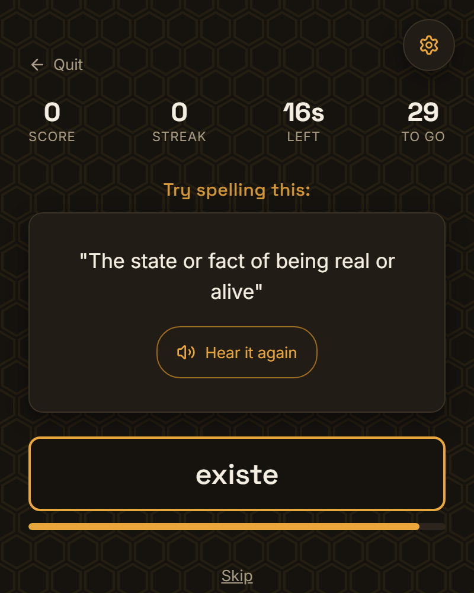
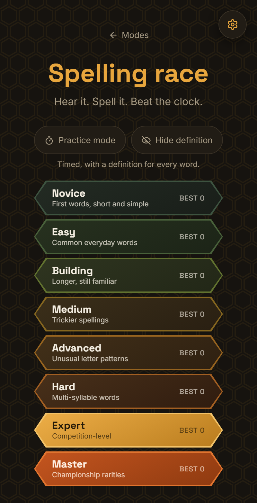
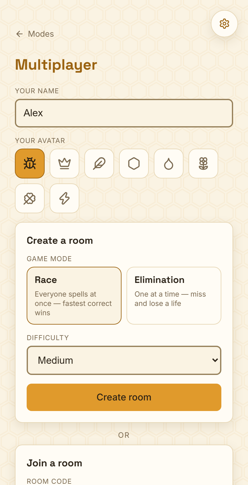

# Spelling Race

A timed spelling game for the browser: it reads a word aloud, you type it. Play alone or against friends in real-time multiplayer rooms.

**Play it:** https://iangopen.github.io/spellingbee/

<p>
  
  
  
</p>

## What it is

The browser's voice speaks each word, and a short definition is shown under it. You type the spelling before the clock runs out.

- **1,200 words** in **8 difficulty tiers** of 150 each, from Novice to Master. Every definition was written for this project.
- **Singleplayer:** 30 words per run, 13 to 22 seconds per word depending on the tier. A correct word scores 10 plus the seconds left. Practice mode turns the clock off, and hide-definition mode leaves you only the audio.
- **Multiplayer:** rooms of up to 8 players, in two modes.
  - **Race:** everyone gets the same word, and the fastest correct answer wins the round. 10 rounds.
  - **Elimination:** players take turns, and a miss costs a life (1 to 9, default 3). Turns get shorter as players drop out and as the table builds a streak.
- **The server keeps score.** Answers are checked and scored in Postgres functions that clients cannot call directly. The browser only receives the results. Five edge functions handle authentication and HTTP, and 20 migrations define the schema, row-level security, rate limits and data retention.

Built with React 19, TypeScript and Vite. Multiplayer runs on Supabase: Postgres, anonymous auth, Realtime, Deno edge functions and pg_cron.

## Get started

You need Node.js 22.12 or later (Vitest 5 requires it).

```sh
npm ci
npm run dev        # http://localhost:5173/spellingbee/
```

Singleplayer works with no further setup. Multiplayer needs a Supabase project and a `.env.local`; see [`supabase/README.md`](supabase/README.md).

```sh
npm test           # 46 client tests (Vitest)
npm run test:db    # 94 database tests: the real migrations under PGlite
npm run build      # type-check and production build
npm run lint       # oxlint
```

The locking tests race separate connections on a real Postgres 17, so they live in their own package:

```sh
npm --prefix supabase/concurrency ci
npm --prefix supabase/concurrency test   # 8 tests
```

## Repository map

```
src/
  components/      screens: mode select, difficulty, round, lobby, elimination turn, results
  hooks/           useGameEngine (singleplayer), useMultiplayerGame, useAnnouncedWord
  lib/             speech (tts.ts), sound effects (sfx.ts), rooms, auth, theme
  data/words/      the word bank, one file per tier
supabase/
  migrations/      schema, row-level security, game engine, retention jobs
  functions/       edge functions: start-game, submit-answer, advance-round,
                   start-elimination-game, submit-turn
  tests/           database tests under PGlite
  concurrency/     locking tests on a real Postgres
scripts/           word-bank pipeline and the build's licence-notice plugin
```

## Roadmap

- A redesign is in progress on the `redesign/spelling-bee` branch. It renames the game to Spelling Bee and gives it a new visual identity. The repository name and the live URL stay the same.

## Credits

| Material | Source and author | Licence |
|---|---|---|
| Word list | [SCOWL](http://wordlist.aspell.net/) by Kevin Atkinson, via [wordlist-english](https://github.com/jacksonrayhamilton/wordlist-english) by Jackson Ray Hamilton | SCOWL notice ([`licenses/SCOWL-Copyright.txt`](licenses/SCOWL-Copyright.txt)); wordlist-english is MIT |
| Inter font | [The Inter Project Authors](https://github.com/rsms/inter) | SIL OFL 1.1 ([`src/assets/fonts/OFL-Inter.txt`](src/assets/fonts/OFL-Inter.txt)) |
| Space Grotesk font | [The Space Grotesk Project Authors](https://github.com/floriankarsten/space-grotesk) | SIL OFL 1.1 ([`src/assets/fonts/OFL-SpaceGrotesk.txt`](src/assets/fonts/OFL-SpaceGrotesk.txt)) |
| Icons | [Lucide](https://lucide.dev), Lucide Icons and Contributors | ISC |
| React, React DOM | Meta Platforms, Inc. and affiliates | MIT |
| supabase-js | Supabase | MIT |

The definitions, sound effects (synthesized in the browser) and all other artwork are original to this project; see [`supabase/WORDLIST_SOURCES.md`](supabase/WORDLIST_SOURCES.md). The deployed site includes every bundled package's licence text at [`third-party-licenses.txt`](https://iangopen.github.io/spellingbee/third-party-licenses.txt).

## Privacy

Singleplayer sends nothing beyond loading the page, except that some browser voices generate speech on the browser maker's servers. Multiplayer signs you in as an anonymous guest and stores your display name and game data for up to 30 days. Details are in [PRIVACY.md](PRIVACY.md).

## License

[MIT](LICENSE)
